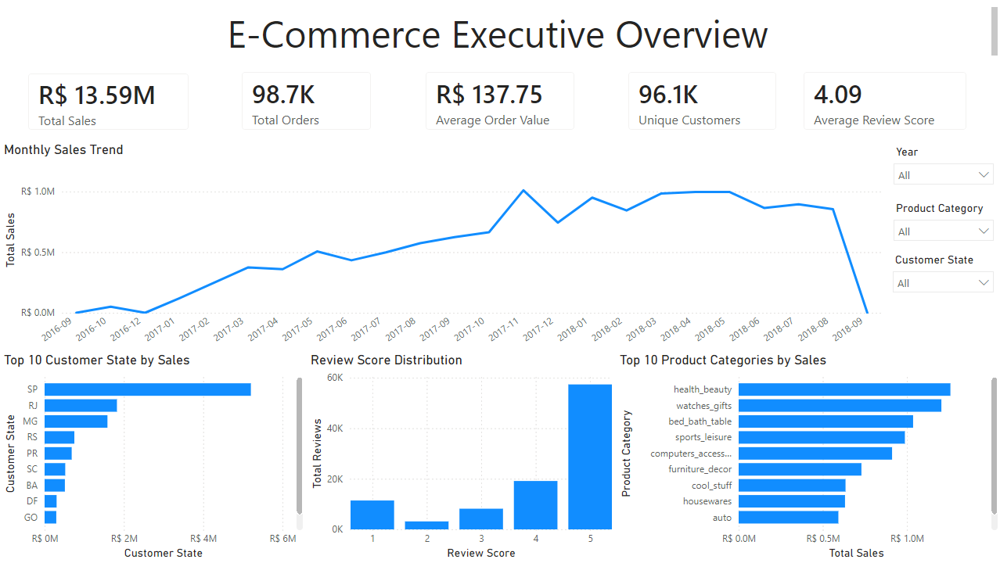
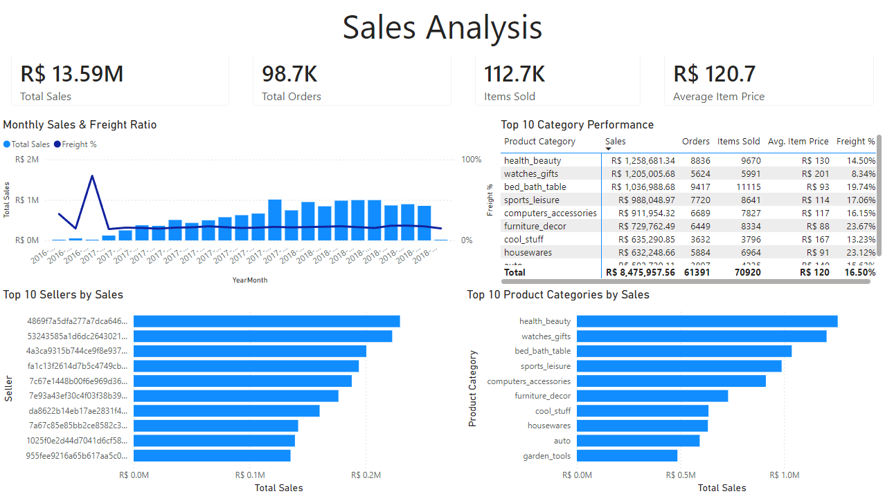
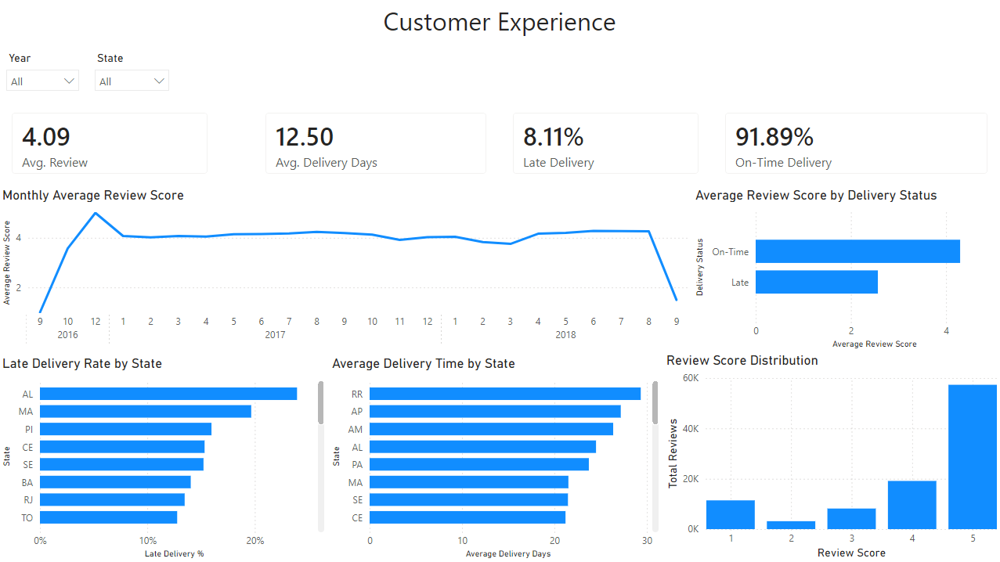

# Brazilian E-Commerce Analytics | Power BI

An end-to-end analysis of the Brazilian Olist e-commerce dataset, exploring sales, product and seller performance, customer reviews, and delivery reliability. The project combines Python data profiling, Power Query transformations, a star-schema analytical core, and DAX measures across three dashboard pages.

The deliverable is a **Power BI Project (.pbip)** with readable semantic-model TMDL and report definitions, rather than only a binary PBIX file.

## Business questions

- How do sales and order volume vary over time and across customer states?
- How do product categories and sellers compare on sales, item volume, and freight ratio?
- What do recorded reviews reveal about customer experience?
- How often are deliveries late, and how is delivery status associated with review scores?

## Dashboard preview

**Executive Overview** — headline KPIs, monthly sales, category/state comparisons, and review distribution.



**Sales Analysis** — category and seller sales, item volume, pricing, and freight ratio.



**Customer Experience** — review trends, delivery performance, and delivery-status comparisons.



The saved report also includes a separate Validation page.

## Key insights

- Sales total approximately **R$13.59M**, across **98.7K orders** and **112.7K items**; the dashboard reports approximately **96.1K unique customer identifiers** and **R$137.75 average order value**.
- The overall average review score is **4.09**. Average delivery time is **12.50 days**, with **8.11% late** and **91.89% on-time** deliveries.
- The delivery-status chart shows higher order-level average review scores for on-time deliveries than for late deliveries. This is an **association, not evidence of causation**; it supports further investigation into delivery reliability, not a predicted improvement from an intervention.

These results are visible in the dashboard screenshots above and documented in [Business Insights](docs/insights.md), with values retained at their displayed precision. Monetary measures are formatted in Brazilian Real (BRL / R$). An exact unrounded sales total and exact delivery-status review averages are not established by the screenshots or TMDL definitions.

## Data model / architecture

```text
Olist CSV files -> Power Query staging -> Dimensions + separate fact tables
                                          -> DAX measures -> Report pages
```

| Analytical table | Grain |
| --- | --- |
| FactSales | One order item: order_id + order_item_id |
| FactPayments | One payment-sequence record: order_id + payment_sequential |
| FactReviews | One review/order pair: review_id + order_id |
| FactOrderExperience | One order: order_id |

**DimCustomer** and **DimDate** filter all four facts; **DimProduct** and **DimSeller** filter FactSales. The ten core relationships are active, one-to-many, and Single-direction from dimensions to facts.

**FactOrderExperience enables order-level delivery-vs-review analysis without direct relationships between the analytical fact tables.** Multiple reviews per order are first aggregated into `AvgReviewScore` in `agg_OrderReviews`, then left-merged into orders. This avoids multiplying delivery records by item or review counts.

`agg_OrderReviews` is a non-loaded Power Query transformation helper (Enable Load disabled), defined in `expressions.tmdl`. Its aggregated scores are merged into FactOrderExperience during preparation; it has no semantic-model relationship. The ten core relationships above are the complete relationship set. See [Data Model](docs/data-model.md) for the implementation.

## Main KPIs and measures

| Measure | Definition / scope |
| --- | --- |
| Total Sales | Sum of FactSales.price; excludes freight |
| Total Orders / Item Sold | Distinct sales order IDs / count of order-item rows |
| Unique Customers | Distinct DimCustomer.customer_unique_id values |
| Average Order Value | Total Sales divided by Total Orders |
| Total Payment Value | Sum of FactPayments.payment_value |
| Average Review Score | Average of individual FactReviews.review_score values |
| Average Delivery Days | Average purchase-to-delivery DATEDIFF per distinct FactSales order |
| Late Delivery % / On-Time Delivery % | Late Deliveries divided by Delivered Orders / its complement |
| Experience Avg Review | Average of nonblank order-level AvgReviewScore values |
| On-Time Avg Review / Late Avg Review | Experience Avg Review filtered by delivery status |

All 25 implemented measures are documented in [Data Model](docs/data-model.md) and defined in [_Measures.tmdl](powerbi/ecommerce-analysis.SemanticModel/definition/tables/_Measures.tmdl).

## Data transformation approach

- Power Query staging reads the CSVs, promotes headers, and assigns types. Orders enrich sales, payments, and reviews through left joins on order_id.
- Monetary source fields `price`, `freight_value`, and `payment_value` use fixed-decimal `Currency.Type` with `en-US` parsing; the fact columns use TMDL `decimal`. Both monetary columns and measures use Brazilian Real (BRL / `R$`) formatting with `pt-BR` currency hints.
- Product categories are left-joined to English translations, with original-category and `Unknown` fallbacks.
- Reviews are grouped by order before merging into FactOrderExperience; delivery status and duration fields are derived there.
- OrderDate is extracted from purchase timestamps. DimDate spans the minimum through maximum FactSales.OrderDate.

### Data profiling

The standard-library Python profiler checks all nine CSVs for structure, inferred types, nulls, duplicate rows, candidate keys, and seven source relationships. It reads raw files without changing them.

```powershell
py scripts/data-cleaning/profile_data.py
```

Requires Python 3.10+. Results print to the console and are saved to `data/processed/data-profile.json` (ignored by Git). Optional `--input-dir` and `--output` arguments override repository-relative defaults. See [Data Dictionary](docs/data-dictionary.md) for source-level results.

## Tools and technologies

Power BI Desktop · Power BI Project (.pbip) · TMDL · Power Query (M) · DAX · Python standard library · Git

## Repository structure

```text
data/
  raw/                         Original CSVs; not committed
  processed/                   Generated profiling output
powerbi/
  ecommerce-analysis.pbip      Project entry point
  ecommerce-analysis.SemanticModel/  TMDL model and queries
  ecommerce-analysis.Report/         Report definitions
scripts/data-cleaning/
  profile_data.py              Profiling and relationship validation
docs/
  images/                     Dashboard screenshots
  data-dictionary.md           Source fields and profiling results
  data-model.md                Implemented model and measures
  insights.md                  Results and interpretation
```

## How to open the Power BI project

1. Clone or download the repository, keeping the `.pbip`, `.Report`, and `.SemanticModel` paths together.
2. Obtain the Brazilian Olist CSV dataset and place its files in `data/raw/`, using the filenames listed in [Data Dictionary](docs/data-dictionary.md). Raw data is excluded from Git.
3. Open [powerbi/ecommerce-analysis.pbip](powerbi/ecommerce-analysis.pbip) in Power BI Desktop with PBIP support.
4. In Power Query, update the staging queries' source paths to your local CSV locations. The saved M expressions currently use absolute paths from the author's machine.
5. Refresh the model, check for source/type errors, and explore the three analysis pages. Use the Validation page and optional Python profiling run to inspect results.

## Data limitations

- Partial months and low review volumes can distort monthly averages. Date filtering uses purchase-date cohorts, not review-submission dates; DimDate coverage is based on FactSales only.
- Review-level and order-level score averages have different weighting. Missing reviews do not describe the experience of unreviewed orders.
- Unique Customers is dimension-based and is not filtered back from sales by Single-direction relationships. Product/seller filters do not filter review or order-experience facts.
- Source profiling found 610 products with null categories and two unmatched category values. See the dictionary for other missing fields and duplicate geolocation records.
- Average Delivery Days has no explicit missing-delivery filter, and experience duration columns are currently declared as strings. Duration types and missing-date handling still require validation.
- Sales is not a profit measure, and delivery/review comparisons do not establish causation.

## Future improvements

- Parameterize source paths for portable refreshes.
- Validate duration types and missing-date handling.
- Validate calendar coverage across all facts.
- Add period-completeness and review-volume context to monthly comparisons.
- Automate checks for row-count preservation and measure reconciliation after refresh.
